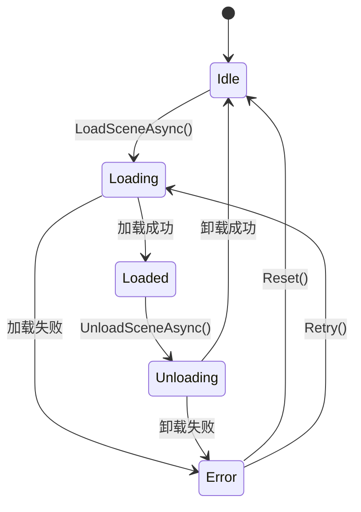

# 游戏场景管理器设计文档

## 架构概述

场景管理器采用基于状态机的设计，利用现有的 EF.Fsm 框架管理场景的生命周期。整个系统由以下核心组件构成：

```
SceneManager (AEFManager)
├── SceneFsm (Fsm<SceneManager>)
│   ├── IdleState (SceneState<SceneManager>)
│   ├── LoadingState (SceneState<SceneManager>)
│   ├── LoadedState (SceneState<SceneManager>)
│   ├── UnloadingState (SceneState<SceneManager>)
│   └── ErrorState (SceneState<SceneManager>)
├── IResourceManager (依赖注入)
└── SceneInfo (场景信息数据结构)
```

## 状态机设计

### 状态定义



### 状态说明

1. **IdleState（空闲状态）**
   - 无场景加载，系统待机
   - 可以接收场景加载请求
   - 状态数据：无

2. **LoadingState（加载中状态）**
   - 正在异步加载场景
   - 提供加载进度回调
   - 状态数据：目标场景信息、加载句柄、进度值

3. **LoadedState（已加载状态）**
   - 场景已成功加载并激活
   - 可以接收场景卸载请求
   - 状态数据：当前场景信息、场景句柄

4. **UnloadingState（卸载中状态）**
   - 正在异步卸载场景
   - 状态数据：场景句柄

5. **ErrorState（错误状态）**
   - 场景加载或卸载过程中发生错误
   - 提供错误信息和恢复选项
   - 状态数据：错误信息、失败的场景信息

## 核心组件设计

### SceneManager

场景管理器主类，负责对外提供API和管理内部状态机。

```csharp
public sealed class SceneManager : AEFManager, ISceneManager
{
    private IFsm<SceneManager> _sceneFsm;
    private IResourceManager _resourceManager;
    private SceneInfo _currentScene;
    
    // 公开API
    public UniTask<bool> LoadSceneAsync(string sceneName, SceneLoadMode mode = SceneLoadMode.Single);
    public UniTask<bool> UnloadSceneAsync();
    public SceneStatus GetCurrentStatus();
    
    // 事件
    public event Action<SceneInfo> OnSceneLoaded;
    public event Action<string> OnSceneUnloaded;
    public event Action<float> OnLoadingProgress;
    public event Action<Exception> OnSceneError;
}
```

### SceneInfo

场景信息数据结构，包含场景的基本信息。

```csharp
public struct SceneInfo
{
    public string Name { get; set; }
    public string Location { get; set; }
    public SceneLoadMode LoadMode { get; set; }
    public LocalPhysicsMode PhysicsMode { get; set; }
    public DateTime LoadStartTime { get; set; }
    public DateTime LoadEndTime { get; set; }
}
```

### SceneState基类

所有场景状态的基类，提供通用功能。

```csharp
public abstract class SceneState : FsmState<SceneManager>
{
    protected SceneManager SceneManager { get; private set; }
    protected IResourceManager ResourceManager { get; private set; }
    
    protected override void OnInit(IFsm<SceneManager> fsm)
    {
        base.OnInit(fsm);
        SceneManager = fsm.Owner;
        ResourceManager = SceneManager.ResourceManager;
    }
}
```

## 数据流设计

### 共享数据

状态机使用 FsmDataCollection 共享以下数据：

- `"TargetScene"`：目标场景信息 (SceneInfo)
- `"SceneHandle"`：当前场景句柄 (SceneHandle)
- `"LoadProgress"`：加载进度 (float)
- `"ErrorInfo"`：错误信息 (Exception)

### 状态转换数据流

1. **开始加载场景**
   ```
   调用者 → SceneManager.LoadSceneAsync()
   → 状态机设置 "TargetScene" 数据
   → 切换到 LoadingState
   ```

2. **加载过程中**
   ```
   LoadingState → 监听 ResourceManager 加载进度
   → 更新 "LoadProgress" 数据
   → 触发 OnLoadingProgress 事件
   ```

3. **加载完成**
   ```
   LoadingState → 设置 "SceneHandle" 数据
   → 切换到 LoadedState
   → 触发 OnSceneLoaded 事件
   ```

## 错误处理策略

### 错误分类

1. **场景不存在错误**：目标场景文件不存在或路径错误
2. **资源加载错误**：网络错误、文件损坏等
3. **内存不足错误**：设备内存不足导致加载失败
4. **状态错误**：在不合适的状态下调用API

### 错误恢复机制

1. **自动重试**：对于临时性错误（如网络错误），自动重试最多3次
2. **回退到安全状态**：发生严重错误时，回退到 IdleState
3. **错误上报**：通过事件机制向上层报告错误信息
4. **降级处理**：如果场景加载失败，可以加载默认的后备场景

## 性能考虑

### 内存管理

- 及时释放已卸载场景的句柄
- 避免在状态机中缓存大量数据
- 使用对象池来管理频繁创建的临时对象

### 加载优化

- 支持场景预加载（暂不在本版本实现）
- 支持加载过程中的暂停和恢复
- 提供加载优先级控制

### 线程安全

- 状态机更新在主线程进行
- 异步加载操作使用 UniTask 确保线程安全
- 事件回调在主线程触发

## 扩展性设计

### 插件接口

为未来的扩展预留接口：

```csharp
public interface IScenePlugin
{
    void OnBeforeSceneLoad(SceneInfo sceneInfo);
    void OnAfterSceneLoaded(SceneInfo sceneInfo);
    void OnBeforeSceneUnload(SceneInfo sceneInfo);
    void OnAfterSceneUnloaded(string sceneName);
}
```

### 配置支持

支持通过配置文件定义场景信息：

```csharp
public class SceneConfiguration
{
    public Dictionary<string, SceneInfo> Scenes { get; set; }
    public string DefaultScene { get; set; }
    public bool AutoRetryOnError { get; set; }
    public int MaxRetryCount { get; set; }
}
```

## 调试和监控

### 调试工具

- 状态机可视化：显示当前状态和状态转换历史
- 场景加载监控：显示加载时间、内存使用等指标
- 错误日志：详细记录错误信息和调用堆栈

### 性能指标

- 场景加载时间统计
- 内存使用量监控
- 状态转换频率分析