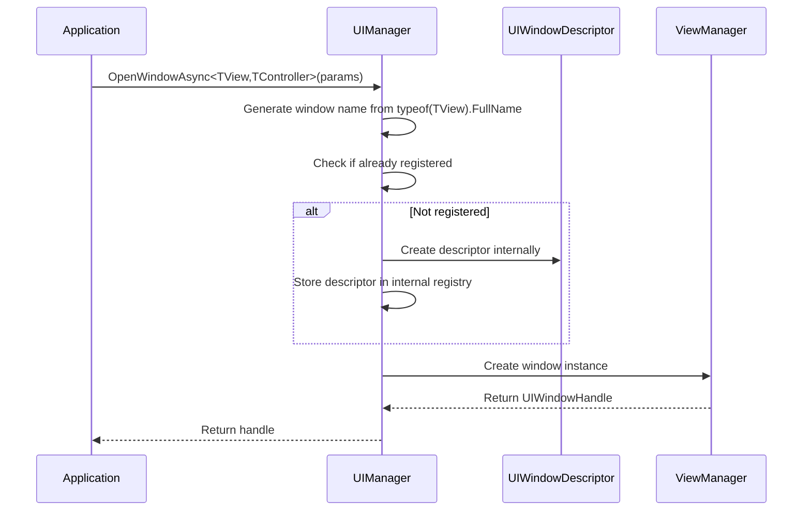

# Design: Simplified UI Window Registration

## Architecture Overview

### Current Architecture
```
Application Code → UIWindowDescriptor.Create() → UIManager.RegisterWindow() → UIManager.OpenWindowAsync(name)
```

### Proposed Architecture
```
Application Code → UIManager.OpenWindowAsync<TView,TController>(params) [Auto-creates descriptor internally]
```

## Key Design Decisions

### 1. 保持UIWindowDescriptor内部使用
**Decision**: 继续在UIManager内部使用UIWindowDescriptor，但不暴露给外部API

**Rationale**:
- 保持内部架构的一致性
- 最小化重构范围
- 保留现有的窗口管理逻辑

**Implementation**: OpenWindowAsync内部自动创建UIWindowDescriptor实例

### 2. 泛型方法签名设计
**Decision**: 使用泛型约束确保类型安全

```csharp
UniTask<UIWindowHandle> OpenWindowAsync<TView, TController>(
    string location,
    UILayer layer = UILayer.Normal,
    bool cacheOnClose = true,
    bool allowMultiple = false,
    object userData = null,
    CancellationToken cancellationToken = default)
    where TView : UIView
    where TController : UIController, new()
```

**Rationale**:
- 类型安全: 编译时检查View和Controller类型
- 默认值: 减少常见场景的参数数量
- 一致性: 与现有API参数保持对应关系

### 3. 窗口标识策略
**Decision**: 使用类型全名作为内部窗口标识符

**Rationale**:
- 自动生成: 无需手动指定窗口名称
- 唯一性: 类型全名保证唯一性
- 类型绑定: 窗口名称与类型强关联

**Implementation**: `typeof(TView).FullName`作为窗口标识

### 4. 向后兼容策略
**Decision**: 保留现有API，标记为Obsolete

**Rationale**:
- 平滑迁移: 现有代码无需立即修改
- 渐进式: 给团队时间适应新API
- 清晰指导: 通过警告指导迁移

## 系统交互

### OpenWindowAsync流程


### 缓存管理
- **Key Strategy**: 使用类型全名作为缓存键
- **Lifecycle**: 与现有缓存机制保持一致
- **Cleanup**: 自动管理，无需外部干预

## Trade-offs分析

### Pros
1. **Developer Experience**: 大幅简化API使用
2. **Type Safety**: 编译时类型检查
3. **Maintainability**: 减少状态管理复杂度
4. **Discoverability**: 所有参数在一个方法中

### Cons
1. **Method Signature**: 参数较多，但可通过默认值缓解
2. **Internal Complexity**: UIManager内部逻辑稍微复杂
3. **Migration Cost**: 需要更新现有代码（可选）

### 备选方案考虑
1. **Builder Pattern**: 考虑过，但增加API复杂度
2. **Configuration Object**: 考虑过，但不如泛型直观
3. **Attribute-based**: 考虑过，但增加反射开销

## 性能影响
- **Registration Overhead**: 从预注册变为懒加载，轻微性能提升
- **Type Resolution**: 泛型参数编译时解析，无运行时开销
- **Memory Usage**: 减少预注册描述符的内存占用

## 兼容性考量
- **Source Compatibility**: 通过重载保持源码兼容
- **Binary Compatibility**: 新增方法，无二进制破坏
- **Behavioral Compatibility**: 功能行为完全一致